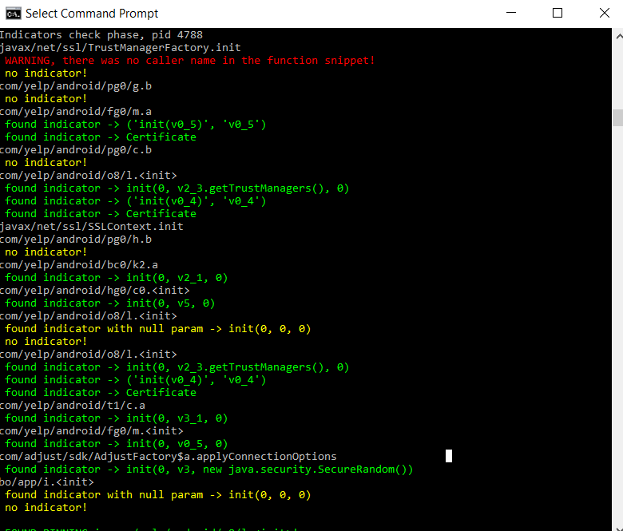
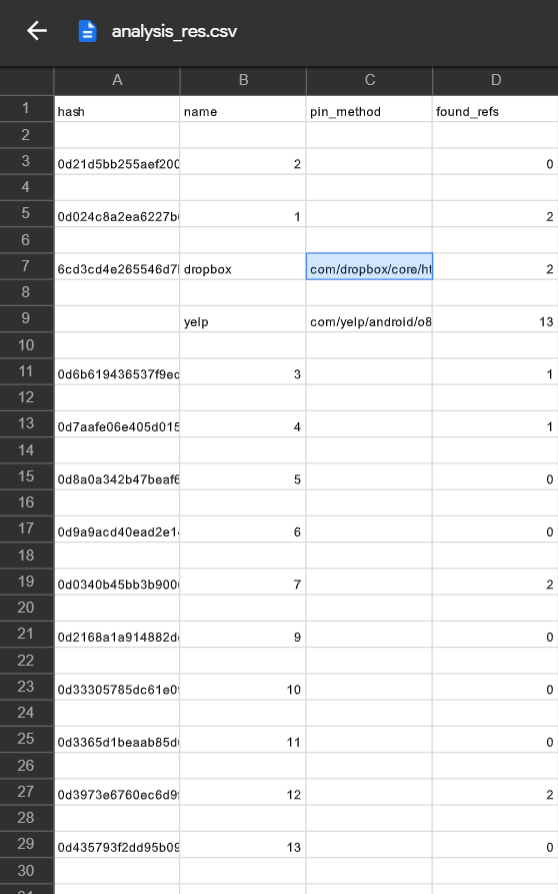

## Statically finding certificate pinning using TrustManager 
This script finds whether an APK pins a certificate for https connections by assiging a certificate to the connection. To see a practical example see:
[Pinning Certificates in Android apps](https://github.com/adava/CertificatePinningExamples/tree/main/TrustManagerCertPin)

## Requirements
- Python 3.0
- Androguard
- Python packages colorama, r2pipe and ZipFile

## Execution
The script works in two modes. 
### Single analysis
    python3  trustManager_strs_xrefs.py [-h] [-p P] [-name NAME] [-sid SID] [-o O] [-db DB] [--printsrc PRINTSRC] app_name
Static analysis of  a single apk involves two phases. In the first phase, cross references are checked, and interesting callers are decompiled. To perform the first phase, type:

    python3  trustManager_strs_xrefs.py [PATH\TO\APK]

This will produce two files, one analysis\[name]_analysis.csv and the other  sources\[name].java. if you didnt provide the name or -sid options the default value of 1 would be used. Optionally, you can change the output folders. Next, you need to run the script on the interesting source snippets (if any). For example:

    python3  trustManager_strs_xrefs.py com.yelp.android_20.39.0-21203920-21203920_minAPI21.apk" -p popular_srcs\yelp.java -name yelp

You can perform the second phase of analysis on any java source code file as long as methods are separated by "|@#$|" characters. The output would show whether a pinning method is found. The result of the analysis would be written to analysis_res.csv file. You can change this via -db option.
If "analysis" and "sources" do not exist, make them before running the scripts:
    
    mkdir sources
    mkdir analysis
### Batch Analysis
You can run the scripts on a set of apks. To do that, type:

    python3 batch_TM.py [PATTH/TO/APKS] -sid 1

The sid option helps you configure the starting id to be used for the apks. For instance, if you want to run the script several times, you can continue from the last id for the next job. Again, in addition to the standard output, a summary of the results will be written to analysis_res.csv that you can change.
	
**Screenshots**

 
 
 